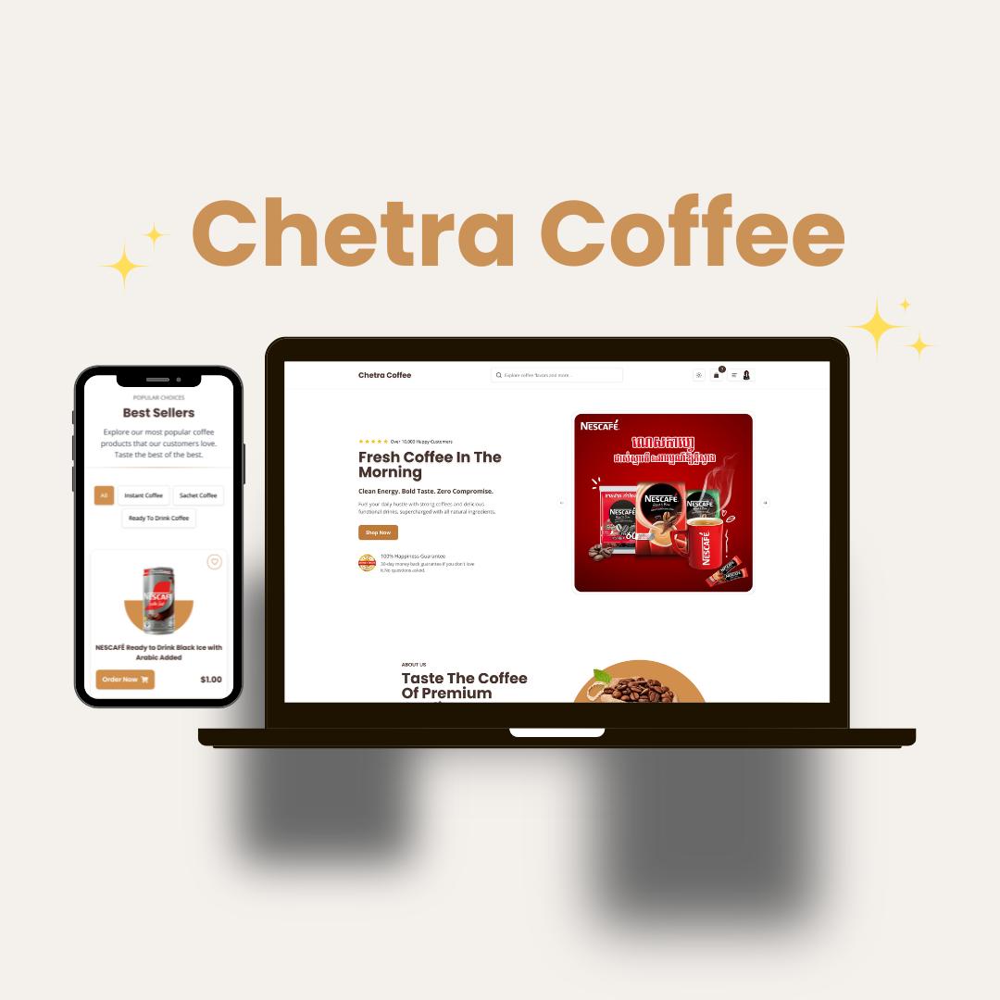

### ☕ Chetra Coffee Shop
Welcome to the Chetra Coffee Shop eCommerce website! This is a fully functional,
modern, and responsive coffee shop website that allows customers to browse and 
purchase a wide variety of coffee products. Built using modern web technologies,
it provides a seamless shopping experience.
### 🚀 Features
- Responsive UI design, Fully responsive with multi-device support
- Dark and Light theme toggle for user preference
- Product Filtering: Users can filter products by category, brand, and coffee type.
- Search Functionality: Quickly search for products by name.
- Sorting Options: Sort products by price, best sellers, and newest.
- Pagination: Efficiently browse products with paginated views.
- Review System: Users can leave reviews for products they have purchased.
- Related Products: Discover similar products on the product detail page.
- Favorite products and share to social media
- User Authentication: Secure login and registration with Clerk.

### 🛠️ Tech Stack
- Frontend: Next.js, React, TailwindCSS, shadcn-ui
- Backend: Next.js API routes, Prisma (Supabase)
- Database: Supabase (PostgreSQL)
- Authentication: Clerk
- Deployment: Vercel
- 
### ⚡ SEO Features
✅ Dynamic Metadata with Next.js generateMetadata for SEO.
✅ Optimized URL structure for better search visibility.
✅ Descriptive titles and meta descriptions.
✅ Open Graph (OG) tags for improved social sharing.
✅ Lazy loading for images to boost performance.

### 🌐 Live Demo
[Visit Chetra Coffee Shop](https://chetracoffee-shop.vercel.app/)

### 📸 Screenshot
